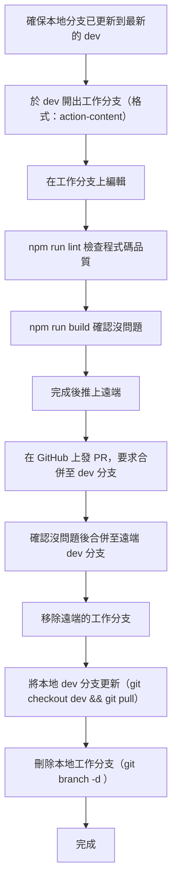
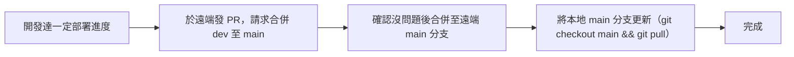
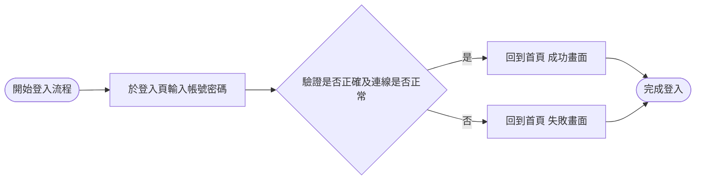
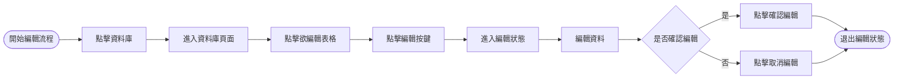
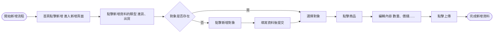

# 倉儲管理系統

## 專案簡介

本專案是一個基於 React 和 TypeScript 開發的倉儲管理系統，提供進貨、出貨、庫存管理等核心功能。

### 設計理念

**本系統專為教導不熟悉電腦的使用者而設計**，因此在開發過程中，我們特別注重以下核心訴求：

- **簡單**：直觀的操作介面，減少學習曲線，讓使用者能快速上手
- **快速**：優化效能表現，確保操作流暢，減少等待時間
- **防呆**：完善的輸入驗證與錯誤提示，避免使用者誤操作
- **手機也要跑得動**：響應式設計，確保在手機等行動裝置上也能流暢運行

## 技術棧

### 核心技術

- **語言**：TypeScript
- **框架**：React
- **打包工具**：Vite

### 第三方套件

#### 畫面相關

- Tailwind CSS - CSS 框架
- Lucide React - 圖標庫

#### 路由與狀態管理

- React Router - 路由管理
- Zustand - 狀態管理
- TanStack Query - 數據獲取與緩存
- TanStack Table - 表格組件
- TanStack Virtual - 虛擬滾動

#### 後端服務

- Supabase - 後端即服務（BaaS）

#### 表單與工具

- React Hook Form - 表單處理
- Day.js - 日期處理
- number-to-chinese-words - 數字轉中文

#### 圖表

- Recharts - 圖表庫

## 開發規範

### Git Flow

#### 常駐分支

- `main` - 主分支（生產環境）
- `dev` - 開發分支

#### 開發流程



#### 部署流程



### 分支命名規範

格式：`<action>-<content>`（烤肉串命名，全小寫）

#### 分支類型

- `feature-<content>` - 新增分支，新增全新畫面、功能等
- `update-<content>` - 更新分支，變更功能邏輯、畫面等
- `refactor-<content>` - 重構分支，重新命名、拆分元件等
- `fix-<content>` - 修復分支，修復異常
- `chore-<content>` - 雜物分支，處理與運作無關的內容，編輯文件等

### Commit 訊息規範

格式：`<type>(<scope>?): <content>`

#### Type 類型

- `feat(scope?): <content>` - 新增功能
- `update(scope?): <content>` - 更新/修改功能
- `refactor(scope?): <content>` - 重構
- `fix(scope?): <content>` - 修復 bug
- `chore(scope?): <content>` - 雜物（配置、文檔等）

## 功能流程

### 註冊流程


### 登入流程



### 讀取流程

#### 電腦版


#### 行動裝置


### 編輯流程



### 新增流程



## 開發指令

```bash
# 開發模式
npm run dev

# 建置專案
npm run build

# 程式碼檢查
npm run lint

# 預覽建置結果
npm run preview
```
